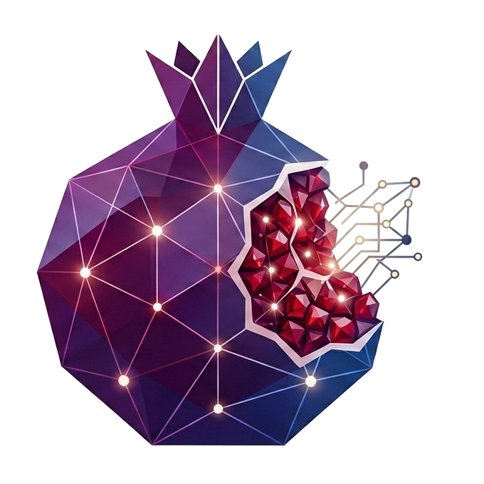

<p align="center">
  
</p>

<h1 align="center">Rumman</h1>

<p align="center"><strong>O ERP que conduz o trabalho de hoje.</strong></p>

<p align="center">
  Aplicativo Android local-first para pequenas empresas de serviços organizarem clientes, orçamentos, ordens de serviço, estoque, compras, financeiro e decisões do dia.
</p>

<p align="center">
  
  
  
  
</p>

<p align="center">
  <a href="https://rumman.app.br">Site oficial</a> ·
  <a href="https://rumman.app.br/recursos">Recursos</a> ·
  <a href="https://rumman.app.br/privacidade">Privacidade</a> ·
  <a href="https://rumman.app.br/termos">Termos</a> ·
  <a href="https://rumman.app.br/excluir-conta">Excluir conta</a>
</p>

## Sobre o aplicativo

O Rumman é um ERP Android guiado para negócios que trabalham no fluxo **orçamento → ordem de serviço → material/estoque → compra → execução → cobrança**. O foco inicial são empresas de manutenção, instalação, assistência técnica, climatização e pequenas oficinas.

Em vez de obrigar o usuário a procurar problemas em vários relatórios, a Home **Hoje no Rumman** cruza os dados locais da operação e apresenta uma fila curta de decisões prioritárias. Cada aviso explica o fato encontrado e abre diretamente o módulo correto, sempre com confirmação humana.

## O que já existe no produto

- clientes com cadastro, edição, busca, filtros e histórico;
- orçamentos com múltiplos itens, aprovação e conversão em ordem de serviço;
- ordens de serviço integradas ao estoque, ao recebimento e ao financeiro;
- estoque por depósito, loja, veículo ou outro local, com entradas, saídas, ajustes, reservas, transferências atômicas, inventário físico e disponibilidade real;
- separação de itens por ordem, retirada ou entrega confirmada e baixa de estoque no momento correto;
- catálogo com produtos, serviços, imagens opcionais e produtos compostos ou kits;
- compras com fornecedores, pedidos, recebimento, custo médio ponderado e integração com contas a pagar;
- locações com reserva, período, local de saída, retirada, devolução, recebimento e conclusão;
- contas a pagar e a receber integradas ao fluxo operacional;
- projeção local de caixa em 7, 30 e 90 dias, DRE gerencial, comparação por período e exportações PDF/XLSX;
- scanner e OCR local-first para documentos;
- assistente com memória, ditado opcional e anexos selecionados, acionado somente pelo usuário;
- autenticação, perfil, biometria e temas claro e escuro;
- proteção da base operacional pelo Android Auto Backup, quando ativado pelo usuário;
- backup portátil criptografado `.rumman` e sincronização estruturada do workspace para aparelhos autorizados;
- equipe com papéis e centro de conflitos;
- Home guiada com regras locais para pendências e prioridades do dia.

### Exemplos da fila guiada

- cobrar recebimentos vencidos;
- dar andamento a serviços agendados;
- repor estoque quando `físico - reservado = disponível` indica falta;
- regularizar contas vencidas;
- acompanhar pedidos de compra atrasados;
- retomar orçamentos enviados sem retorno;
- orientar o primeiro cadastro da empresa.

As regras iniciais são determinísticas, executadas localmente e baseadas nos dados do próprio negócio. IA é usada como apoio para explicar e interpretar quando necessário, não como promessa de automação mágica.

## Backup e troca de aparelho

Perdeu ou trocou o celular? Com o backup do aparelho ativado, o Android pode restaurar a base operacional do Rumman usando a mesma Conta Google. O banco Room `rumman.db` participa do Android Auto Backup e da transferência entre aparelhos pela área privada de backup da conta do próprio cliente, sem usar Firebase, VPS ou armazenamento pago pelo Rumman.

Essa camada é controlada pelo Android, tem limite total de 25 MB por aplicativo e normalmente é executada uma vez ao dia quando as condições do sistema são atendidas. Credenciais, tokens, cache, imagens digitalizadas e anexos são excluídos.

O backup portátil criptografado `.rumman` e a sincronização estruturada do workspace são recursos separados do Android Auto Backup. Fotos, arquivos externos, credenciais, tokens e caminhos locais não entram automaticamente no payload de sincronização.

## Arquitetura Android

```text
app
├── core
│   ├── data           # Room, DataStore, Firebase e integrações
│   ├── domain         # modelos, contratos e regras de negócio
│   └── designsystem   # Material 3, temas, tipografia e componentes
└── feature
    ├── auth
    ├── home
    ├── clients
    ├── operations
    ├── finance
    ├── scanner
    └── assistant
```

| Camada | Tecnologias e decisões |
| --- | --- |
| UI | Kotlin, Jetpack Compose, Material 3, Navigation Compose |
| Persistência | Room e DataStore com estratégia local-first |
| Proteção da base | Android Auto Backup e transferência entre aparelhos, quando habilitados na Conta Google |
| Arquitetura | Projeto modular, fluxo unidirecional e separação por domínio |
| Conta e proteção | Firebase Authentication, App Check e Play Integrity |
| Diagnóstico | Firebase Crashlytics |
| Assistente | Gateway Cloudflare e processamento solicitado pelo usuário |
| Qualidade | testes, Detekt, Ktlint, Android Lint e R8 |

## Identificação

```text
Aplicativo: Rumman · ERP Inteligente Guiado
Plataforma: Android
Application ID: br.app.rumman
Desenvolvedor: Pascoal Eti
Ano de criação: 2026
Status: desenvolvimento privado
```

O aplicativo ainda não está publicado para uso geral. Recursos em desenvolvimento só são apresentados como disponíveis depois de implementação, testes e validação no Android.

## Sobre este repositório público

Este repositório apresenta o **produto Android Rumman**, sua identidade, documentação pública, páginas legais e materiais do domínio oficial. O código-fonte de produção do aplicativo é proprietário e mantido em repositório privado.

O histórico público registra a evolução da marca e do produto sem conceder permissão para copiar, modificar, redistribuir ou criar derivados. Consulte [LICENSE](LICENSE).

## Contato

- Site: [rumman.app.br](https://rumman.app.br)
- Comercial, suporte e privacidade: [e-mail@rumman.app.br](mailto:e-mail@rumman.app.br)
- Contato técnico: [devs@pascoal.eti.br](mailto:devs@pascoal.eti.br)
- Desenvolvimento: [pascoal.eti.br](https://pascoal.eti.br)

---

<p align="center">© 2026 Rumman · Feito com amor no Brasil.</p>
